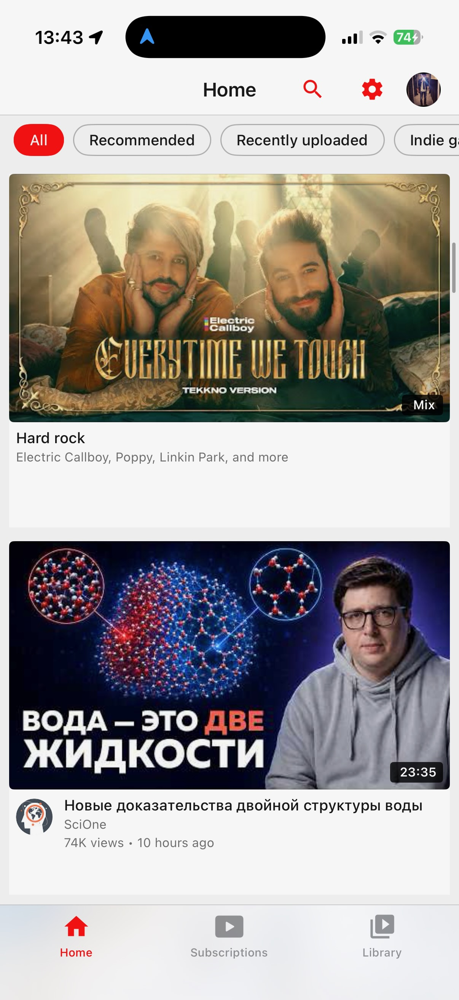
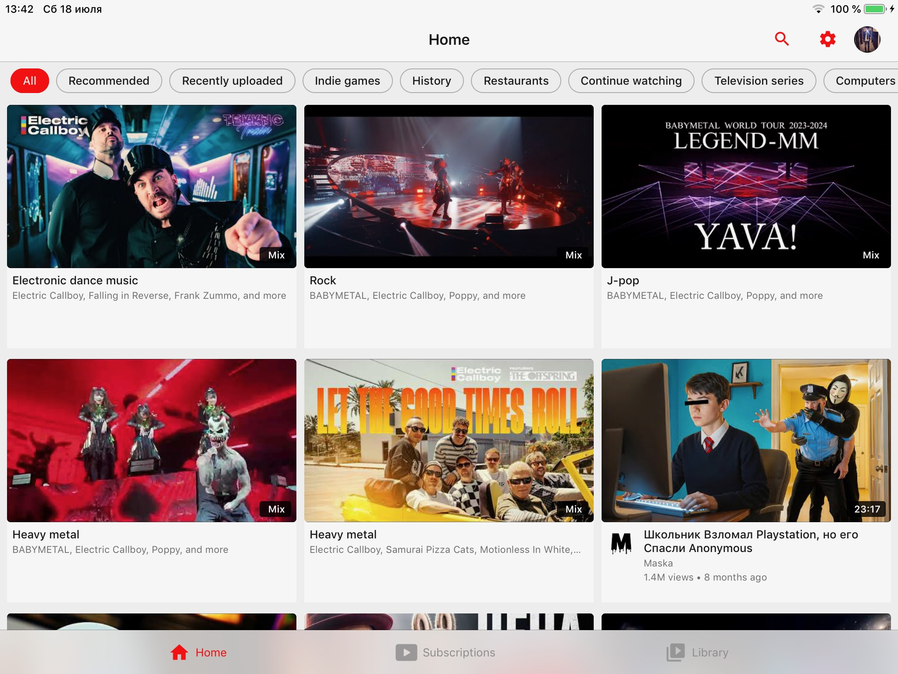

<div align="center">

# YTLite

**A lightweight, native YouTube client for iOS 12+. No ads, no tracking, no dependencies.**

[](https://github.com/verback2308/YTLite/releases/latest)
[](https://github.com/verback2308/YTLite/releases)

[](LICENSE)

<br>

<picture>
  <source media="(prefers-color-scheme: dark)" srcset="screenshots/app/iphone/dark/recommendations.jpeg">
  
</picture>
<picture>
  <source media="(prefers-color-scheme: dark)" srcset="screenshots/app/iphone/dark/player.jpeg">
  
</picture>
<picture>
  <source media="(prefers-color-scheme: dark)" srcset="screenshots/app/iphone/dark/channel.jpeg">
  
</picture>
<picture>
  <source media="(prefers-color-scheme: dark)" srcset="screenshots/app/iphone/dark/subscriptions.jpeg">
  
</picture>

<sub>Screenshots follow your GitHub theme — the app supports both light and dark mode.</sub>

</div>

## Why

When Google dropped support for the official YouTube app on older devices, there was no way to watch videos properly. Browsers capped quality at 360p — and even that barely ran. YTLite was born to restore what was lost: high-quality playback on hardware that still works fine, just ignored by Google. The "Lite" stands for a focused, lightweight client that does one thing well — let you watch YouTube.

> [!NOTE]
> This project is not related to [dayanch96/YTLite](https://github.com/dayanch96/YTLite) (YouTube Plus). The name collision is accidental.

## Features

- **Video playback** — up to 1080p 60fps on every device; 2K/4K on hardware with AV1 decode (iPhone 15 Pro and newer, M3+ iPads)
- **Kids content** — plays videos the standard API sources refuse, via a dedicated playback source
- **Pinch to zoom** — fill the screen in fullscreen with a pinch, or turn on Zoom to Fill to do it automatically
- **Background audio** — continue listening with the screen off
- **Media controls** — play/pause and next/previous video from Control Center, the lock screen and headphones
- **Picture-in-Picture** — watch while using other apps
- **SponsorBlock** — skip sponsored segments automatically
- **Return YouTube Dislike** — see dislike counts again
- **Subtitles** — full subtitle/caption support with VTT parsing
- **Search & browse** — live suggestions, recent-search history, filters (sort, upload date, type, duration), channel pages, playlists
- **Smart home feed** — endless recommendations with category chips read from your feed's shelves
- **Subscriptions** — follow channels with a local subscription feed
- **Watch history** — progress indicators, synced across devices
- **Autoplay** — automatically play the next related video
- **Auto theme** — follows system dark mode on iOS 13+, scheduled hours on iOS 12; manual override available

<div align="center">

<picture>
  <source media="(prefers-color-scheme: dark)" srcset="screenshots/app/ipad/dark/player.jpeg">
  
</picture>

<sub>Native iPad layout — player and related videos side by side.</sub>

</div>

<details>
<summary><b>More screenshots</b></summary>
<br>
<div align="center">

<picture>
  <source media="(prefers-color-scheme: dark)" srcset="screenshots/app/iphone/dark/settings.jpeg">
  
</picture>
<picture>
  <source media="(prefers-color-scheme: dark)" srcset="screenshots/app/ipad/dark/recommendations.jpeg">
  
</picture>

<picture>
  <source media="(prefers-color-scheme: dark)" srcset="screenshots/app/ipad/dark/channel.jpeg">
  
</picture>
<picture>
  <source media="(prefers-color-scheme: dark)" srcset="screenshots/app/ipad/dark/subscriptions.jpeg">
  
</picture>

</div>
</details>

## Installation

YTLite runs on devices with **iOS 12 and above**.

### Non-jailbroken devices

**Option 1 — Add source (recommended)**

Add the YTLite source to your sideloading app to receive automatic updates:

<a href="https://stikstore.app/altdirect/?url=https://raw.githubusercontent.com/verback2308/YTLite/main/source/apps.json"></a>

**Option 2 — Manual install**

[Download the latest IPA](https://github.com/verback2308/YTLite/releases/latest) and install via **SideStore**, **AltStore**, or **LiveContainer**.

**Option 3 — Build from source**

```bash
git clone https://github.com/verback2308/YTLite.git
cd YTLite
cp Config/Local.xcconfig.example Config/Local.xcconfig
./make_ipa.sh
```

### Jailbroken devices

**Option 1 — Cydia/Sileo repo (recommended)**

Add the repo to your package manager to install YTLite and receive automatic updates:

```
https://verback2308.github.io/ytlite/
```

Rootful (`iphoneos-arm`) and rootless (`iphoneos-arm64`) packages are provided; Sileo, Zebra and Cydia are supported. Every released version stays available in the repo, so you can also install or roll back to an older one (Sileo/Zebra: package page → version list). If you previously installed the IPA via AppSync, uninstall it before installing from the repo.

**Option 2 — Manual install**

Install the `.ipa` package directly:
- **Filza** — open the `.ipa` file → Install
- **ReProvision** — sign and install the IPA from the app

## Known Issues and Limitations

- Audio track selection is not possible yet (dubbed videos play their original audio)
- Playback speeds above 2x may cause issues
- **Shorts** are not natively supported — they are treated as regular videos, but can be hidden from the subscriptions feed
- Comments are displayed as a flat read-only list
- Offline download is not yet available

## Playback Helper Server

The Mobile Web playback source (used for videos the primary source can't open, e.g. kids content) relies on a small companion service. Preparing these streams requires evaluating JavaScript from YouTube's public player page — something iOS 12-era devices can't do on-device. The app delegates that single step to the helper server and receives the computed result back.

**What it sees:** no account data, no tokens, no cookies, no watch history — only the challenge strings taken from the public player code and the ID of the video being prepared. If you're inspecting traffic and wondering about requests to a non-YouTube host — that's this.

The server's source code will be published later so you can host your own instance and point the app at it (**Settings → Debug → Solver Server**).

## Bug Reports

If you encounter a bug, you can export debug logs directly from the app:

**Settings → Debug → Share Debug Log**

This generates a log file you can attach to your GitHub issue. The log includes timestamped playback, API, and caching events that help diagnose problems.

<details>
<summary><b>For developers</b></summary>

## Building

```bash
git clone https://github.com/verback2308/YTLite.git
cd YTLite
cp Config/Local.xcconfig.example Config/Local.xcconfig
open YTLite.xcodeproj
```

Edit `Config/Local.xcconfig` and set your own `PRODUCT_BUNDLE_IDENTIFIER`.

Select the **YTVLite** scheme, choose your device or simulator, and build (⌘B).

## Architecture

```
YTLite/
├── App/              Composition root: AppDelegate, DI wiring, tab bar
├── Core/             Shared kernel (features depend on it, never on each other)
│   ├── API/          YouTube Innertube API client
│   ├── Auth/         OAuth device-code flow
│   ├── Config/       URLs, UserDefaults keys, constants
│   ├── Transport/    HTTP abstraction + decorators
│   ├── Playback/     VideoSource contracts, sources, HLS machinery
│   ├── Services/     Caching, SponsorBlock, RYD, subtitles, watchtime
│   └── Common/       Shared UI components & utilities
└── Features/         One vertical slice per feature
    ├── Channel/      Channel page with tabs
    ├── Home/         Home feed
    ├── Library/      Playlists & saved videos
    ├── Player/       Video player & watch page
    ├── Profile/      User profile
    ├── Search/       Search with suggestions
    └── Subscriptions/ Subscription feed
```

### Key Design Decisions

- **Zero external dependencies** — Networking via a custom `HTTPTransport` abstraction over `URLSession`, images via custom `ThumbnailImageView`, playback via `AVPlayer`
- **All UIKit, no SwiftUI** — Programmatic layout, no storyboards
- **iOS 12+ support** — No SF Symbols, no SwiftUI, no Combine
- **Manual JSON parsing** — `JSONSerialization` + dictionary traversal for YouTube Innertube API responses
- **Dependency injection** — `ServiceContainer` provides services; view controllers receive dependencies via initializers

### Playback Pipeline

Playback is built on a single `VideoSource` abstraction — each way of playing a video implements the same interface and owns both stream resolution and quality selection. `PlaybackFacade` just asks a factory for the configured source, calls `loadPlayback`, and hands the prepared `AVPlayerItem` to the player shell. The sources:

1. **Auto** *(default)* — Composite: tries Android VR first, transparently falls back to Mobile Web when a video fails to resolve or start.
2. **Android VR** — Streams via YouTube's Innertube API; adaptive formats (360p–1080p AVC, up to 4K AV1 on supported hardware) are converted from DASH SIDX byte ranges into an HLS playlist for native `AVPlayer`, with progressive/native-HLS fallbacks.
3. **Mobile Web** — Handles videos the Android VR client refuses (e.g. kids content). Stream URLs require solving JavaScript challenges from the player page; that step is delegated to the helper server (see above), everything else stays on-device.
4. **Progressive** — Direct 360p MP4 URL for the restricted case (e.g. server-side A/B experiments).

Quality selection is source-agnostic: the player UI simply renders whatever qualities the active source reports. Background audio is `AVAudioSession`-based and works across all sources.

### Authentication

OAuth device-code flow: the app requests a device code → user enters it at google.com/device → tokens are stored in Keychain. Anonymous browsing is supported.

## Project Structure

| Component | Purpose |
|-----------|---------|
| `InnertubeClient` | YouTube API: browse, search, player, comments, subscriptions |
| `PlaybackFacade` | Selects a `VideoSource` via factory, loads it, and drives player setup |
| `VideoPlayerView` | Custom player UI with controls, gestures, PiP |
| `WatchViewController` | Watch page: player + metadata + comments + related |
| `AppCache` | Dual-layer cache (memory + disk) with TTL |
| `SponsorBlockController` | SponsorBlock API integration |
| `ThemeManager` | App-wide theming (dark/light) |

## Contributing

1. Fork the repository
2. Create a feature branch (`git checkout -b feature/my-feature`)
3. Commit your changes (`git commit -am 'Add my feature'`)
4. Push to the branch (`git push origin feature/my-feature`)
5. Open a Pull Request

Please follow the existing code style. SwiftLint is configured and runs as a build phase.

</details>

## Support

If YTLite keeps your old device alive, you can support development:

<a href="https://buymeacoffee.com/verback2308" target="_blank" rel="noopener noreferrer"></a>

## Credits

- [SponsorBlock](https://github.com/ajayyy/SponsorBlock) — crowdsourced API for skipping sponsored segments
- [Return YouTube Dislike](https://github.com/Anarios/return-youtube-dislike) — community-maintained dislike count data
- [yt-dlp](https://github.com/yt-dlp/yt-dlp) — invaluable reference for understanding YouTube's playback infrastructure
- [YouTubeLegacy](https://github.com/PoomSmart/YouTubeLegacy) — inspiration for keeping YouTube alive on older devices

## Legal

This project is for educational and personal use. It is not affiliated with, endorsed by, or connected to Google or YouTube. Use at your own risk.

## License

MIT
